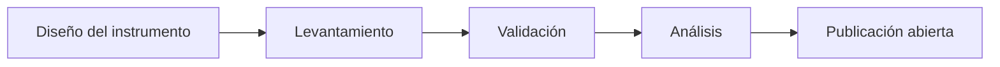

# Censo Nacional de Bibliotecas

!!! info "Propósito"
    Construir el primer mapa sistemático y actualizado de las bibliotecas del Ecuador.

---

## ¿Por qué es necesario?

Actualmente no existe un registro consolidado y actualizado de las bibliotecas del país. Esto dificulta:

- La formulación de políticas públicas
- La asignación de recursos
- La planificación estratégica del sector
- La cooperación interinstitucional

---

## ¿Qué información se levantará?

??? note "Datos institucionales"
    - Tipo de biblioteca  
    - Dependencia administrativa  
    - Ubicación geográfica  

??? note "Infraestructura"
    - Espacio físico  
    - Equipamiento tecnológico  
    - Conectividad  

??? note "Recursos humanos"
    - Número de bibliotecarios  
    - Nivel de formación  
    - Tipo de contratación  

??? note "Servicios"
    - Servicios presenciales  
    - Servicios digitales  
    - Actividades culturales  

---

## Resultados esperados

- Base de datos abierta
- Informes estadísticos
- Visualizaciones comparativas
- Identificación de brechas regionales

---

## Metodología general

