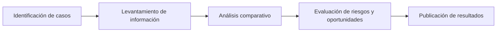

# Inteligencia Artificial en Bibliotecas

!!! info "Línea estratégica 2"
    Analizar el nivel de adopción, gobernanza e impacto de la inteligencia artificial en bibliotecas ecuatorianas.

---

## Justificación

La inteligencia artificial está transformando procesos documentales, servicios digitales y modelos de gestión.  
Sin embargo, no existe evidencia sistemática sobre su incorporación real en bibliotecas del país.

Esta línea busca medir, analizar y orientar su implementación responsable.

---

## Dimensiones de análisis

=== "1. Nivel de adopción"

    - Uso experimental
    - Implementación parcial
    - Integración institucional
    - Herramientas utilizadas

=== "2. Áreas de aplicación"

    - Catalogación y metadatos
    - Referencia virtual
    - Automatización de procesos
    - Análisis de datos
    - Servicios personalizados

=== "3. Gobernanza y ética"

    - Políticas internas
    - Protección de datos
    - Transparencia algorítmica
    - Uso responsable

=== "4. Capacidades institucionales"

    - Formación del personal
    - Infraestructura tecnológica
    - Presupuesto destinado
    - Sostenibilidad del modelo

---

## Productos

- Diagnóstico nacional sobre IA en bibliotecas
- Informe comparativo por tipología
- Recomendaciones estratégicas
- Guía de buenas prácticas

---

## Metodología

