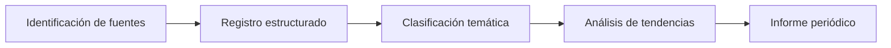

# Monitoreo de Noticias y Tendencias

!!! info "Línea estratégica 3"
    Seguimiento sistemático del discurso público, políticas y transformaciones del sector bibliotecario.

---

## Justificación

Las decisiones políticas, inversiones y reformas sectoriales suelen anunciarse primero en medios de comunicación y comunicados oficiales.

El monitoreo estructurado permite anticipar cambios y comprender la narrativa pública sobre bibliotecas.

---

## Dimensiones de análisis

=== "1. Registro básico"

    - Fecha
    - Medio o fuente oficial
    - Enlace
    - Región

=== "2. Clasificación temática"

    - Política pública
    - Inversión o financiamiento
    - Innovación tecnológica
    - Eventos académicos
    - Crisis, cierres o conflictos

=== "3. Análisis cualitativo"

    - Impacto potencial
    - Tendencias recurrentes
    - Actores involucrados
    - Enfoque del discurso

---

## Productos

- Base estructurada de noticias
- Informes trimestrales de tendencias
- Análisis del discurso sectorial
- Identificación de riesgos y oportunidades

---

## Metodología

