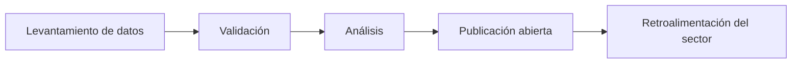

# Quiénes somos

El Observatorio de Bibliotecas del Ecuador es una iniciativa independiente orientada a la generación, análisis y difusión de información estratégica sobre el estado, evolución y desafíos de las bibliotecas en el país.

!!! info "Naturaleza del Observatorio"
    Iniciativa independiente, sin fines de lucro, basada en datos abiertos y transparencia metodológica.

---

## Nuestra razón de ser

Las bibliotecas constituyen infraestructuras fundamentales para el desarrollo educativo, cultural y científico. Sin embargo, en el Ecuador no existen datos sistemáticos y actualizados que permitan comprender su situación real.

El Observatorio surge para cubrir esa brecha mediante la producción de información verificable y accesible.

---

## Coordinación

=== "Fundador y Coordinador"

**Luis Enrique Lescano Borrego**  
Especialista en bibliotecas – Universidad de Cuenca  

Profesional con experiencia en gestión bibliotecaria, automatización de sistemas, repositorios institucionales, análisis documental e innovación en servicios de información.

---

## Manifiesto

!!! abstract "Declaración fundacional"
    Creemos que no se puede transformar lo que no se mide.  
    Creemos que las bibliotecas deben tomar decisiones basadas en evidencia.  
    Creemos en la transparencia, la colaboración y la innovación responsable.

---

## Objetivos

=== "Objetivo general"

    Generar información confiable, sistemática y accesible sobre las bibliotecas del Ecuador para fortalecer la toma de decisiones y el diseño de políticas.

=== "Objetivos específicos"

    - Desarrollar un censo nacional de bibliotecas.  
    - Analizar el nivel de incorporación de inteligencia artificial.  
    - Monitorear tendencias y noticias del sector.  
    - Publicar informes periódicos con datos abiertos.  
    - Promover una cultura de análisis en el ámbito bibliotecario.

---

## Líneas de trabajo

??? note "1. Censo Nacional de Bibliotecas"
    Levantamiento sistemático de información sobre tipología, infraestructura, recursos humanos y servicios.

??? note "2. Inteligencia Artificial en Bibliotecas"
    Análisis del grado de adopción de tecnologías emergentes y sus implicaciones.

??? note "3. Monitoreo de Noticias y Tendencias"
    Seguimiento estructurado de eventos, políticas públicas y transformaciones del sector.

---

## Cómo funcionamos

